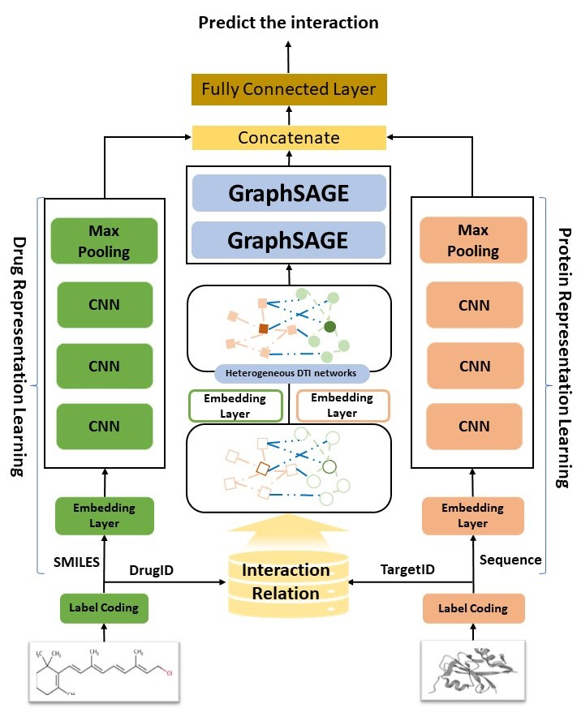

# SSGraphDTI
SSGraphDTI: integrating structural and systems biology features to enhance drug-target relationship prediction performance

## SSGraphDTI

## Setup and dependencies 

Dependencies:
- python 3.9.16
- pytorch >=1.12
- pyg	2.2.0
- rdkit	2022.9.5
- numpy
- sklearn
- tqdm
- tensorboardX
- prefetch_generator
- matplotlib

## Resources:
+ README.md: this file.
+ data: The datasets used in paper.
	+ Systems biology dataset: Construct a heterogeneous network related to drug-target pairs
 		+ Dataset_KB：	all *.csv files in DrugKB folder	
   		+ Dataset_Yamanishi: 	drug_smiles.csv + protein_fasta.csv + drug_drug.csv + protein_protein.csv + drug_protein.csv
  	+ Structural biology dataset：They are used as input for training the model.
  		+ DrugBank:	DrugBank35022.txt
  	 	+ Dataset_in_net:DrugBank7710.txt
  	  	+ dataset after remove related data:new7710.txt
  	  	+ Dataset_out_net:out_net_data.txt
  	  	+ Dataset_less:DrugBank2570.txt

+ dataset.py: data process.
+ hyperparameter.py: set the hyperparameters of SSGraphDTI.
+ model.py: SSGraphDTI model architecture and Read systems biology data.
+ pytorchtools: early stopping.
+ SSGraphDTI.py: train and test the model.

# Run:

python SSGraphDTI.py
